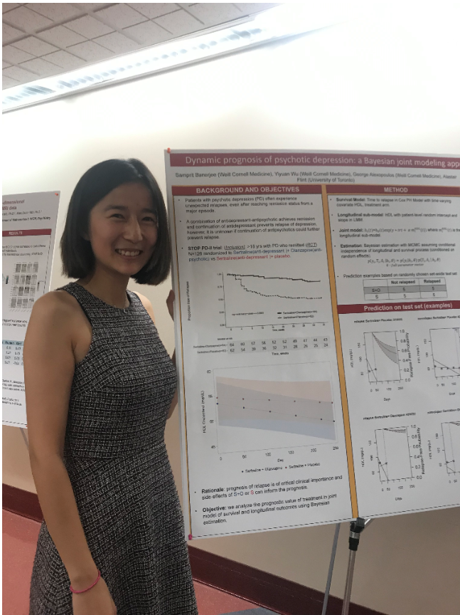

---
---

<link rel="stylesheet" href="styles.css" type="text/css">

My name is Yiyuan Wu and I like to analyze data to answer research questions and test hypotheses.The combination of medicine and mathematics makes perfect career for me. Currently I investigate questions related to mental health through my work as a Research Biostatistician II at [Weill Cornell Medicine](http://hpr.weill.cornell.edu/divisions/hpe/) in the department of Health Policy & Research 

I graduated from the [Rutgers University](https://stat.rutgers.edu/) with a MS in biostatistics in 2015. I started working in the department of critical care medicine as the only statistician where I help researchers with their various research projects in the area of emergency medicine. 

I am an R enthusiast and very experienced with SAS, I am also an active member of [R Ladies NYC](http://www.rladiesnyc.org/). 

My research interest include deep learning, casual mediation analysis. I am attending Causal Mediation Analysis boot camp at [Columbia University](https://www.mailman.columbia.edu/research/) in July, 2019.

My full CV is available [here](files/Wu_CV_April2019.pdf).